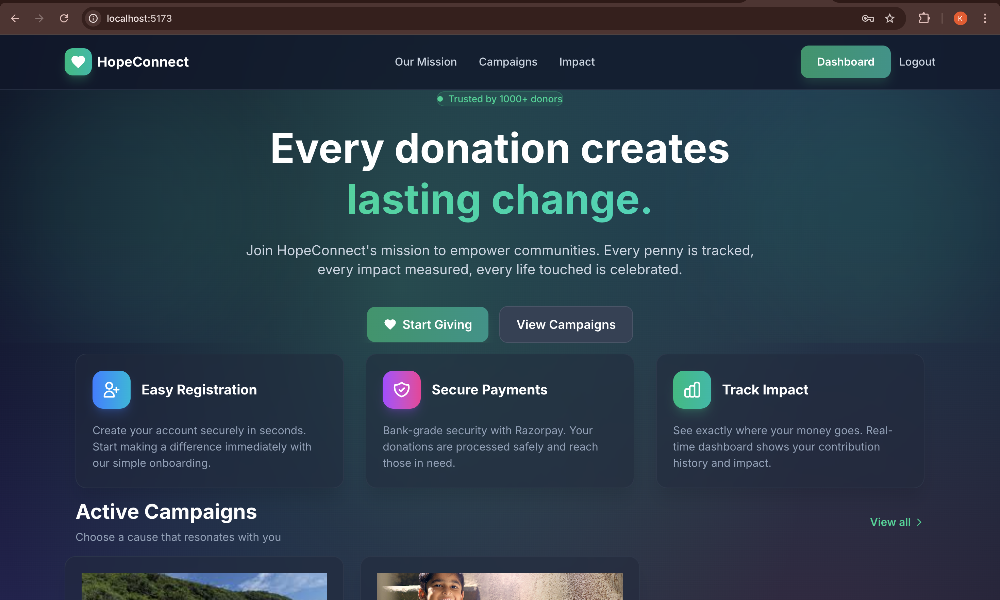
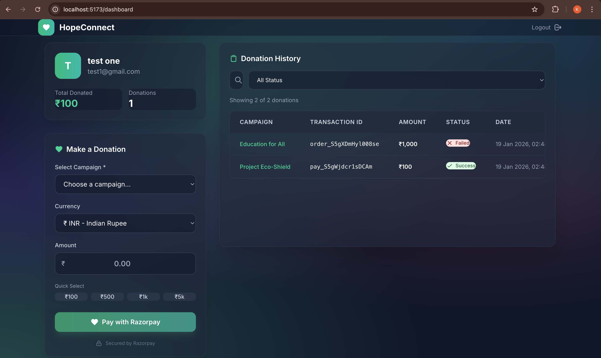
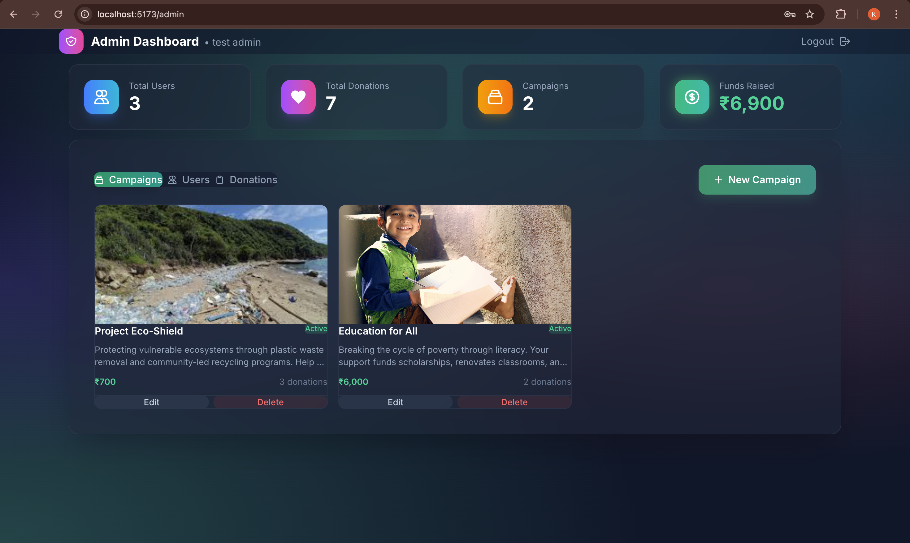

# HopeConnect - Donation Management System

A modern, full-stack donation management platform for NGOs built with React, Node.js, Express, and MongoDB.


## 🌟 Features

### For Donors
- **Easy Registration** - Quick and secure account creation
- **Campaign Browsing** - View active fundraising campaigns
- **Secure Payments** - Razorpay integration for safe transactions
- **Donation History** - Track all your contributions
- **Real-time Dashboard** - See your impact at a glance

### For Administrators
- **Campaign Management** - Create, edit, and delete campaigns
- **User Management** - View all registered donors
- **Donation Logs** - Complete transaction history with filters
- **Analytics Dashboard** - Track funds raised, donors, and campaigns

## 🛠️ Tech Stack

| Layer | Technology |
|-------|------------|
| Frontend | React 18, Vite, TailwindCSS v4 |
| Backend | Node.js, Express.js |
| Database | MongoDB Atlas, Mongoose |
| Authentication | JWT, bcrypt, HTTP-only cookies |
| Payments | Razorpay SDK |

## 📁 Project Structure

```
NGO DMS/
├── client/                 # React frontend
│   ├── src/
│   │   ├── api/           # API configuration
│   │   ├── components/    # Reusable components
│   │   ├── context/       # Auth context
│   │   ├── pages/         # Page components
│   │   └── index.css      # Global styles
│   └── .env               # Frontend environment variables
│
└── server/                 # Node.js backend
    ├── models/            # Mongoose schemas
    ├── routes/            # API routes
    ├── middleware/        # Auth middleware
    ├── server.js          # Express server
    └── .env               # Backend environment variables
```

## 🚀 Getting Started

### Prerequisites
- Node.js 18+
- MongoDB Atlas account
- Razorpay account (for payments)

### Installation

1. **Clone the repository**
   ```bash
   git clone https://github.com/yourusername/ngo-dms.git
   cd ngo-dms
   ```

2. **Setup Backend**
   ```bash
   cd server
   npm install
   ```
   
   Create `.env` file:
   ```env
   MONGODB_URI=your_mongodb_connection_string
   JWT_SECRET=your_secret_key
   PORT=3000
   NODE_ENV=development
   CORS_ORIGIN=http://localhost:5173
   RAZORPAY_API_KEY=your_razorpay_key
   RAZORPAY_API_SECRET=your_razorpay_secret
   ```

3. **Setup Frontend**
   ```bash
   cd client
   npm install
   ```
   
   Create `.env` file:
   ```env
   VITE_API_URL=http://localhost:3000/api
   ```

4. **Run the application**
   
   Backend:
   ```bash
   cd server
   npm start
   ```
   
   Frontend:
   ```bash
   cd client
   npm run dev
   ```

5. **Open** http://localhost:5173

## 📡 API Endpoints

### Authentication
| Method | Endpoint | Description |
|--------|----------|-------------|
| POST | `/api/auth/register` | Create new user |
| POST | `/api/auth/login` | Login user |
| POST | `/api/auth/logout` | Logout user |
| GET | `/api/auth/me` | Get current user |

### Campaigns
| Method | Endpoint | Description |
|--------|----------|-------------|
| GET | `/api/campaigns` | Get active campaigns |
| GET | `/api/campaigns/admin/all` | Get all campaigns (admin) |
| POST | `/api/campaigns` | Create campaign (admin) |
| PUT | `/api/campaigns/:id` | Update campaign (admin) |
| DELETE | `/api/campaigns/:id` | Delete campaign (admin) |

### Donations
| Method | Endpoint | Description |
|--------|----------|-------------|
| GET | `/api/donate/key` | Get Razorpay key |
| POST | `/api/donate/initiate` | Create order |
| POST | `/api/donate/verify` | Verify payment |
| GET | `/api/user/history` | Get donation history |

### Admin
| Method | Endpoint | Description |
|--------|----------|-------------|
| GET | `/api/admin/dashboard` | Get stats |
| GET | `/api/admin/users` | Get all users |
| GET | `/api/admin/donations` | Get all donations |

## 🌐 Deployment

### Frontend (Vercel)
1. Push code to GitHub
2. Connect repo to Vercel
3. Set environment variable: `VITE_API_URL`
4. Deploy

### Backend (Render)
1. Push code to GitHub
2. Create Web Service on Render
3. Set root directory: `server`
4. Add all environment variables
5. Deploy

## 🔐 Environment Variables

### Backend (.env)
```env
MONGODB_URI=          # MongoDB connection string
JWT_SECRET=           # Secret for JWT tokens
PORT=3000             # Server port
NODE_ENV=production   # Environment
HTTPS=true            # Enable secure cookies
CORS_ORIGIN=          # Frontend URL
RAZORPAY_API_KEY=     # Razorpay key
RAZORPAY_API_SECRET=  # Razorpay secret
```

### Frontend (.env)
```env
VITE_API_URL=         # Backend API URL
```

## 📱 Screenshots

### Landing Page


### User Dashboard


### Admin Dashboard


---
